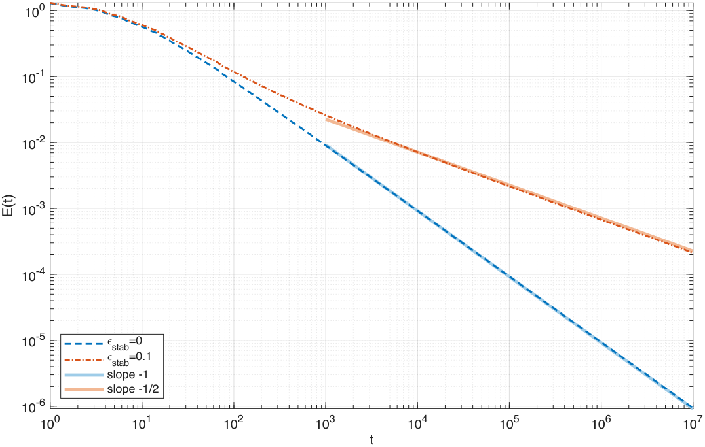

# Code For Reproducing Paper "Low-Rank Adaptive Friction for Memory-Efficient LLM Pretraining".

This repository contains code for the paper:

>**[Low-Rank Adaptive Friction for Memory-Efficient LLM Pretraining](https://rajit906.github.io/Rank_1_iKFAD_NeurIPS_OPT_2026.pdf)**<br>
>Rajit Rajpal, Benedict Leimkuhler<br>
>**Abstract:** "iKFAD is a recently proposed optimizer that replaces adaptive learning rates with adaptive friction in the momentum dynamics. Its full friction tensor ξ ∈ R^(m×n) has the same O(mn) memory cost per layer as Adam's second-moment buffer. Here we introduce Rank-1 iKFAD (R-iKFAD), which represents this tensor using row and column statistics. This reduces the friction state dimension to O(m+n) values per layer and approximately halves the size of iKFAD's optimizer state. Across GPT2-Nano, TinyViT, DistilBERT, and GPT2-S, R-iKFAD matches or improves on iKFAD while using nearly half the optimizer memory. We also analyze its continuous-time dynamics. Under strong convexity, we prove exponential convergence when γ>0 and convergence when γ=0, as used in our experiments. A formal averaging calculation predicts t⁻¹ decay when ε_stab=0 and t⁻¹ᐟ² decay when ε_stab>0. Numerical results are consistent with both predictions."<br>

The project includes four experiments with optimizer implementations (iKFAD and R-iKFAD) in the `optimizers/` directory. Adam is taken from `torch.optim` and Adafactor from `transformers.optimization` with its optional first moment enabled. Hyperparameter sweep drivers and per-optimizer launch scripts are available inside each experiment folder — `nano/` (GPT2-Nano on Shakespeare), `vit/` (TinyViT on CIFAR-10), `sst2/` (DistilBERT on SST-2) and `owt_gpt2s/` (GPT2-S on OpenWebText) — and each provides a conda environment configuration file. The notebook `results.ipynb` regenerates the loss, accuracy and ablation figures from the per-seed curves in `*/sweep-table/`, without retraining.

```bash
jupyter nbconvert --execute --inplace results.ipynb   # writes the figures into figs/
```

```bash
conda env create -f vit/environment.yml && conda activate vit
python vit/sweep.py --optimizer rikfad0 --n_trials 100      # hyperparameter search
python vit/run_best_seeds.py --optimizer rikfad0            # seed replicates
```

Launch scripts under `*/scripts/` are SLURM wrappers with the cluster-specific directives removed; adapt the partition and account lines to your site.

### Theory numerics

`theory_numerics/` holds the numerical verification of the continuous-time `gamma = 0`
analysis: the reduced energy `E = f(X) - f(X*) + 0.5*||P||_F^2` decays like `t^-1` when
`epsilon_stab = 0` and like `t^-1/2` when `epsilon_stab > 0`, with a crossover at
`E ~ alpha*mu*epsilon_stab`.



Long trajectories to `T = 1e7` come from the BACD splitting implemented in
`theory_numerics/rikfad.c`, since adaptive integration is impractical at that horizon;
the short-horizon parameter sweeps use MATLAB's `ode89`. Everything regenerates from the
shipped runs without recomputing them:

```bash
cd theory_numerics
matlab -batch plot_gamma0_decay          # the figure above
matlab -batch validate_rates             # exponent, prefactor and crossover sweeps
matlab -batch validate_bacd_steps        # step-size refinement check
python3 slopes.py long_4x3_e0.dat 1e6:1e7
```

Final-decade slopes over `[1e6, 1e7]` are `-0.989`, `-0.998`, `-0.999` at
`epsilon_stab = 0` and `-0.497`, `-0.501`, `-0.503` at `epsilon_stab = 0.1`, for `2x2`,
`4x3` and `6x5` respectively. See `theory_numerics/README.md` for the objective, both
integrators, and the file map.

### MIT License

```
Copyright (c) 2026 Rajit Rajpal

Permission is hereby granted, free of charge, to any person obtaining a copy
of this software and associated documentation files (the "Software"), to deal
in the Software without restriction, including without limitation the rights
to use, copy, modify, merge, publish, distribute, sublicense, and/or sell
copies of the Software, and to permit persons to whom the Software is
furnished to do so, subject to the following conditions:

The above copyright notice and this permission notice shall be included in all
copies or substantial portions of the Software.

THE SOFTWARE IS PROVIDED "AS IS", WITHOUT WARRANTY OF ANY KIND, EXPRESS OR
IMPLIED, INCLUDING BUT NOT LIMITED TO THE WARRANTIES OF MERCHANTABILITY,
FITNESS FOR A PARTICULAR PURPOSE AND NONINFRINGEMENT. IN NO EVENT SHALL THE
AUTHORS OR COPYRIGHT HOLDERS BE LIABLE FOR ANY CLAIM, DAMAGES OR OTHER
LIABILITY, WHETHER IN AN ACTION OF CONTRACT, TORT OR OTHERWISE, ARISING FROM,
OUT OF OR IN CONNECTION WITH THE SOFTWARE OR THE USE OR OTHER DEALINGS IN THE
SOFTWARE.
```
